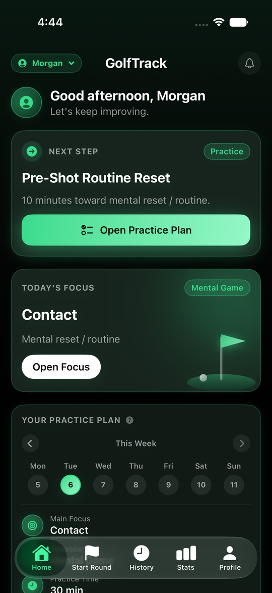
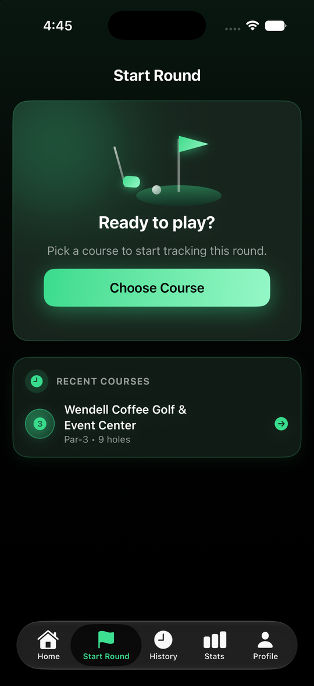
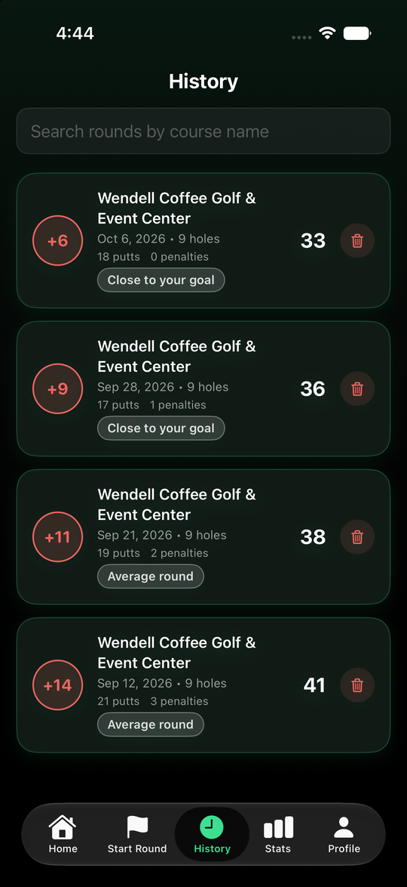
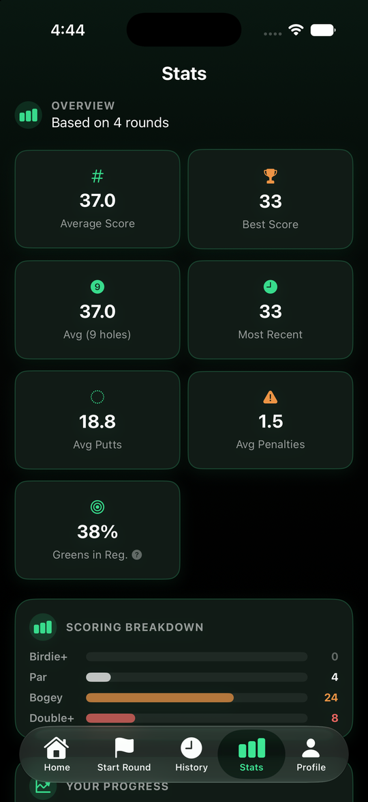

# GolfTrack

GolfTrack is a SwiftUI iPhone app for tracking golf rounds, hole-by-hole scoring, club trends, post-round reflection, and practice recommendations.

## Screenshots

Screenshots use built-in sample rounds, not real scores.

<p>
  
  
  
  
</p>

## What It Does

- Track 3-hole, 5-hole, 9-hole, 18-hole, or custom-length rounds
- Save custom courses with per-hole par and optional yardage
- Record strokes, putts, penalties, tee club, shot result, contact quality, misses, and notes
- Review completed rounds with scoring summaries and hole history
- Generate round advice and a focused practice plan
- Track club tendencies from saved shot data

## Open The Project

Open this file in Xcode:

```text
GolfTrack/GolfTrack.xcodeproj
```

Use the `GolfTrack` scheme to run the app.

## Free Developer Account Note

Apps installed from Xcode with a free Apple Developer account may expire after about 7 days. Re-running the main `GolfTrack` app scheme from Xcode should usually refresh the install without deleting app data. Deleting the app from the iPhone deletes local SwiftData storage.

## Project Structure

```text
GolfTrack/GolfTrack/App        App entry and tab navigation
GolfTrack/GolfTrack/Models     SwiftData models
GolfTrack/GolfTrack/Services   Storage, analysis, and stats services
GolfTrack/GolfTrack/Views      SwiftUI screens and reusable UI
```

## Development

The Xcode project is generated from `GolfTrack/project.yml` with XcodeGen:

```bash
cd GolfTrack
xcodegen generate
```

After making changes:

```bash
git add -A
git commit -m "Describe what changed"
git push
```
